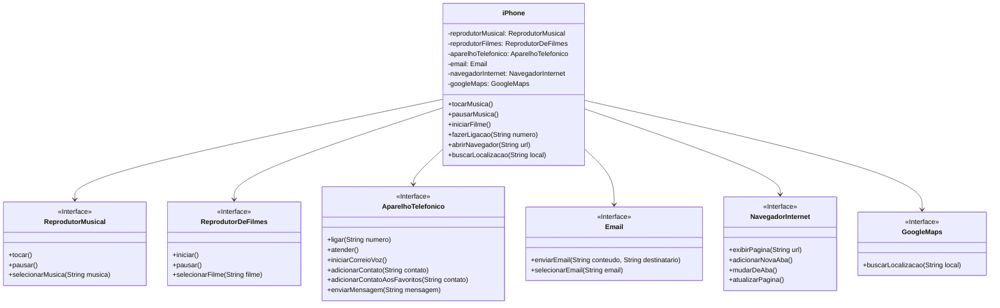

# Desafio POO

```mermaid

classDiagram
    class ReprodutorMusical {
        <<Interface>>
        +tocar()
        +pausar()
        +selecionarMusica(String musica)
    }

    class ReprodutorDeFilmes {
        <<Interface>>
        +iniciar()
        +pausar()
        +selecionarFilme(String filme)
    }

    class AparelhoTelefonico {
        <<Interface>>
        +ligar(String numero)
        +atender()
        +iniciarCorreioVoz()
        +adicionarContato(String contato)
        +adicionarContatoAosFavoritos(String contato)
        +enviarMensagem(String mensagem)
    }

    class Email {
        <<Interface>>
        +enviarEmail(String conteudo, String destinatario)
        +selecionarEmail(String email)
    }

    class NavegadorInternet {
        <<Interface>>
        +exibirPagina(String url)
        +adicionarNovaAba()
        +mudarDeAba()
        +atualizarPagina()
    }

    class GoogleMaps {
        <<Interface>>
        +buscarLocalizacao(String local)
    }

    class iPhone {
        -reprodutorMusical: ReprodutorMusical
        -reprodutorFilmes: ReprodutorDeFilmes
        -aparelhoTelefonico: AparelhoTelefonico
        -email: Email
        -navegadorInternet: NavegadorInternet
        -googleMaps: GoogleMaps
        +tocarMusica()
        +pausarMusica()
        +iniciarFilme()
        +fazerLigacao(String numero)
        +abrirNavegador(String url)
        +buscarLocalizacao(String local)
    }

    iPhone --> ReprodutorMusical
    iPhone --> ReprodutorDeFilmes
    iPhone --> AparelhoTelefonico
    iPhone --> Email
    iPhone --> NavegadorInternet
    iPhone --> GoogleMaps
```
